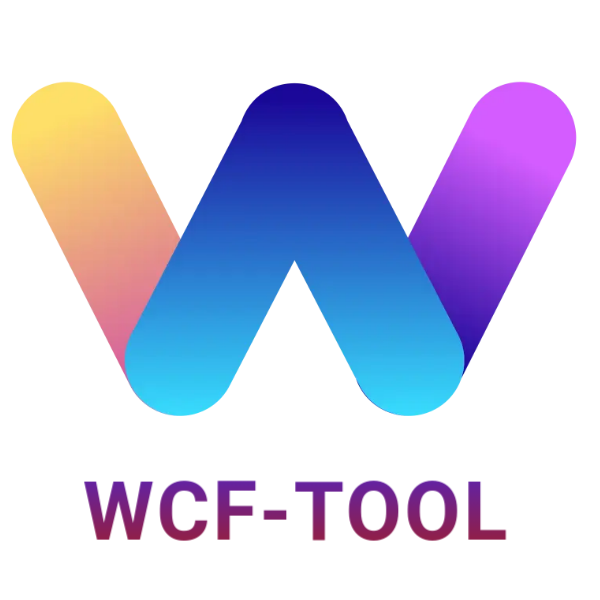
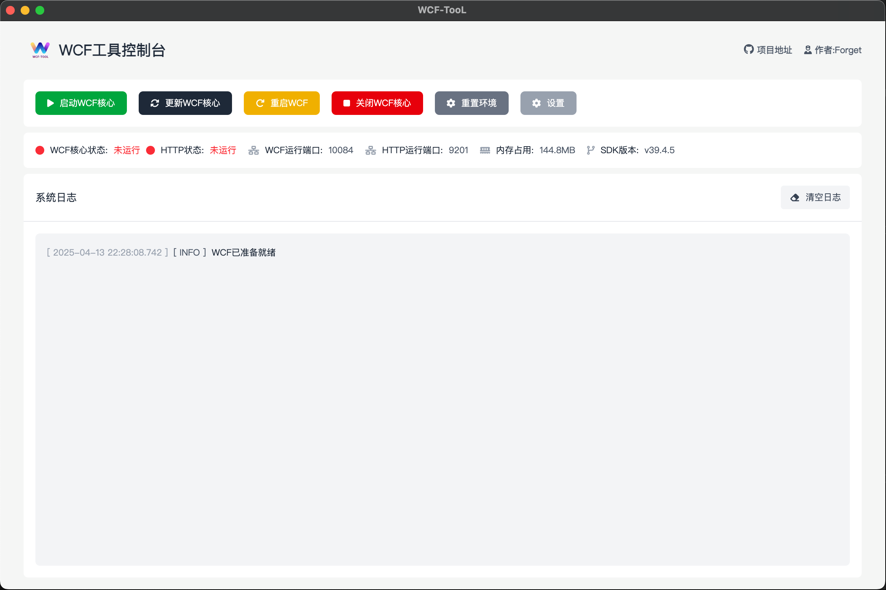

# WCFerry 客户端管理工具

<p align="center">
  
</p>

<p align="center">基于Vue3+Electron的WCFerry DLL注入管理客户端</p>

## 功能特点

- 🚀 便捷的 WCF DLL 注入管理界面
- 🔄 Service 模式支持，保持 WCF 后台运行
- 🌐 内置 HTTP 服务，提供完整 API 接口
- 🔧 可视化配置界面
- 🔔 实时状态监控
- 📊 运行日志记录
- 🔄 自动更新功能

## 软件界面



## 安装方式

### 方法一：直接下载

从[Release 页面](https://github.com/dr-forget/wcferry-node/releases)下载最新版本的安装包。

### 方法二：源码构建

```bash
# 克隆仓库
git clone https://github.com/dr-forget/wcferry-node.git

# 进入项目目录
cd wcferry-node/packages/cli-app

# 安装依赖
pnpm i

# 构建应用
npm run build:win

# 启动应用
npm run dev
```

## 使用说明

1. **DLL 注入管理**

   - 注入 WCF DLL 到微信进程
   - 卸载已注入的 DLL
   - 查看注入状态

2. **Service 模式**

   - 启动 Service 服务，使 WCF 在后台持续运行
   - 停止 Service 服务
   - 配置 Service 自启动

3. **HTTP API 服务**
   - 启动/停止 HTTP 服务
   - 配置 HTTP 服务端口
   - 设置访问权限

## HTTP API 接口

### 基础信息

- 默认端口：`8080`
- 认证方式：API Key (可在设置中配置)

### 主要接口

| 接口路径     | 方法 | 描述              |
| ------------ | ---- | ----------------- |
| `/`          | GET  | 获取 WCF 配置信息 |
| `/start-wcf` | GET  | 启动 WCF          |
| `/close-wcf` | GET  | 关闭 WCF          |

### 请求示例

```javascript
// 获取WCF配置信息Ï
fetch('http://localhost:8080', {})
  .then((response) => response.json())
  .then((data) => console.log(data));
```

## 常见问题

**Q: 注入失败怎么办？**
A: 请确保微信已经启动，并且使用了兼容的微信版本。您可以在日志中查看详细错误信息。

**Q: HTTP 服务无法访问？**
A: 请检查防火墙设置，确保 HTTP 服务端口已开放。

## 开发相关

### 技术栈

- 前端: Vue 3, TypeScript, Element Plus
- 桌面端: Electron
- 构建工具: Vite

### 项目结构

```
wcferry-node/
├── packages/
│   ├── cli-app/         # 客户端应用
│   ├── core/            # 核心功能模块
│   └── http-server/     # HTTP服务实现
└── scripts/             # 构建和部署脚本
```

## 许可证

MIT
